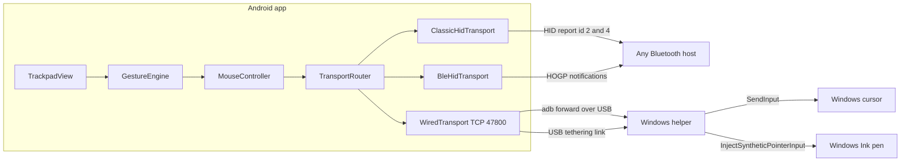
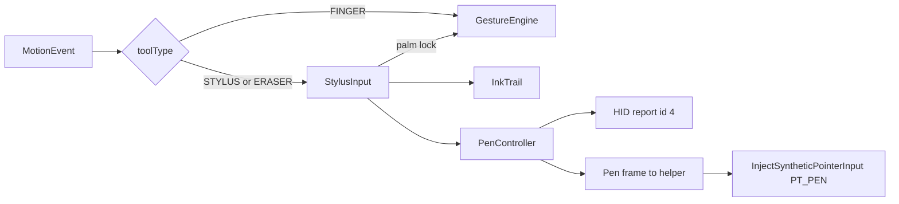
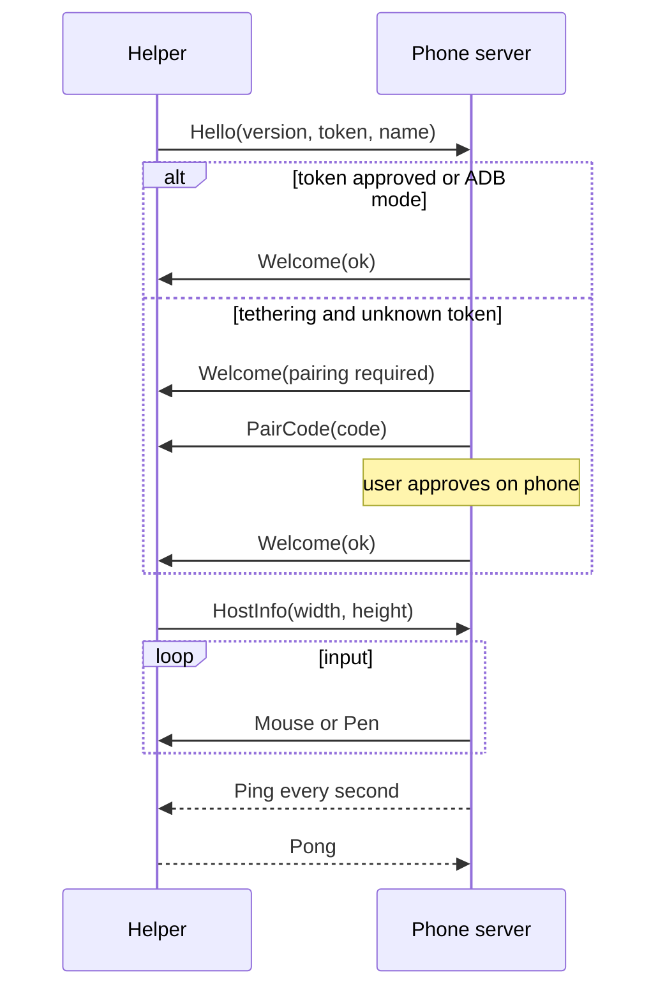

<!-- assets/diagrams/system-overview.md: transport topology and S Pen input routing diagrams. -->

# System overview diagrams

## Transport topology

```mermaid
flowchart LR
  subgraph phone [Android app]
    Trackpad[TrackpadView] --> Gesture[GestureEngine]
    Gesture --> Mouse[MouseController]
    Mouse --> Router[TransportRouter]
    Router --> Classic[ClassicHidTransport]
    Router --> Ble[BleHidTransport]
    Router --> WireSrv["WiredTransport TCP 47800"]
  end
  Classic -->|"HID report id 2 and 4"| BtHost[Any Bluetooth host]
  Ble -->|"HOGP notifications"| BtHost
  WireSrv -->|"adb forward over USB"| Helper[Windows helper]
  WireSrv -->|"USB tethering link"| Helper
  Helper -->|SendInput| Cursor[Windows cursor]
  Helper -->|"InjectSyntheticPointerInput"| Ink[Windows Ink pen]
```

## S Pen input routing

```mermaid
flowchart LR
  Ev[MotionEvent] --> Split{toolType}
  Split -->|FINGER| Gest[GestureEngine]
  Split -->|"STYLUS or ERASER"| Sty[StylusInput]
  Sty -->|palm lock| Gest
  Sty --> InkTrail[InkTrail]
  Sty --> PenCtl[PenController]
  PenCtl --> BtPen["HID report id 4"]
  PenCtl --> WirePen["Pen frame to helper"]
  WirePen --> Inject["InjectSyntheticPointerInput PT_PEN"]
```

## Wired session

```mermaid
sequenceDiagram
  participant H as Helper
  participant P as Phone server
  H->>P: Hello(version, token, name)
  alt token approved or ADB mode
    P->>H: Welcome(ok)
  else tethering and unknown token
    P->>H: Welcome(pairing required)
    P->>H: PairCode(code)
    Note over P: user approves on phone
    P->>H: Welcome(ok)
  end
  H->>P: HostInfo(width, height)
  loop input
    P->>H: Mouse or Pen
  end
  P-->>H: Ping every second
  H-->>P: Pong
```
